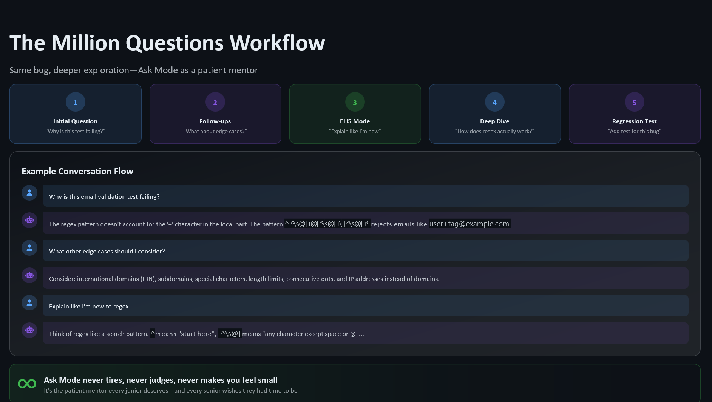

<div class="hero">
  
</div>

<span class="chapter-badge">Chapter 6</span>

# The Million Questions Workflow

Here's something that stops a lot of developers from using Copilot Chat effectively: the feeling that they should already know the answer.

You look at an error. You know you *should* understand this. You've seen similar patterns before. Asking feels like admitting something. So you search Stack Overflow, scan docs, try a few things, spend 45 minutes going in circles — when a single, well-formed question to Copilot Chat would have gotten you there in three.

The million questions workflow is a permission structure. It gives you explicit permission to ask.

---

## Where the Shame Comes From

Asking questions has a status overhead in engineering culture. Being the person who knows the answer is valued. Being the person who asks "basic" questions can feel uncomfortable, especially in teams with implicit seniority signals.

Copilot Chat removes the social overhead entirely. There's no one watching. There's no record. There's no colleague to impress or disappoint.

That means you can ask the question you'd be embarrassed to ask in a Slack channel. And you should. Many of those questions unlock important things.

---

## The Workflow in Practice

The million questions workflow is exactly what it sounds like: ask a lot of questions. Build your understanding iteratively, one question at a time.

**Iteration 1: The big picture**
```
What does this codebase's authentication flow look like?
Walk me through it at a high level.
```

**Iteration 2: Zoom in**
```
How does the token refresh work specifically?
Where does that happen in the code?
```

**Iteration 3: Verify your understanding**
```
I think what happens is: the access token expires, the client detects a 401,
calls /refresh with the refresh token, and gets a new access token.
Is that right? What am I missing?
```

**Iteration 4: Get to the question you actually have**
```
If the refresh token is also expired, what happens?
Does the current implementation handle that gracefully?
```

This took four questions. It would have taken 45 minutes of solo spelunking. And you now understand the auth flow better than a quick scan would have given you.

---

## Good Iteration Patterns

!!! tip "Prompts that unlock deeper understanding"
    - "Explain this to me like I'm unfamiliar with this codebase."
    - "What could go wrong with this approach?"
    - "Are there edge cases this doesn't handle?"
    - "What would you do differently, and why?"
    - "Give me a simpler version of this first."
    - "What's the tradeoff between this approach and [alternative]?"

Notice what these have in common: they're not asking Copilot to do the work. They're asking it to help you think.

---

## When to Stop Asking

The million questions workflow has a natural end state: the moment you could explain the thing to a colleague without referring back to the chat.

That's your signal. Not "I understand it well enough to ship" — that's a different (lower) bar. The colleague test is the right bar, because it forces you to articulate the understanding, not just feel it.

---

## The Shame Reframe

If you find yourself reluctant to ask "too many" questions — even in private, with an AI — notice that. It's a signal worth investigating.

The developers who ask the most questions aren't the weakest ones. They're often the most rigorous. They're doing the work of understanding, not just the work of doing.

Asking is a skill. Build it without shame.

---

[← Chapter 5: Turn a Failing Test](05-failing-test.md){ .md-button } &nbsp; [Next: Chapter 7 — A Mentor Loop →](07-mentor-loop.md){ .md-button }
