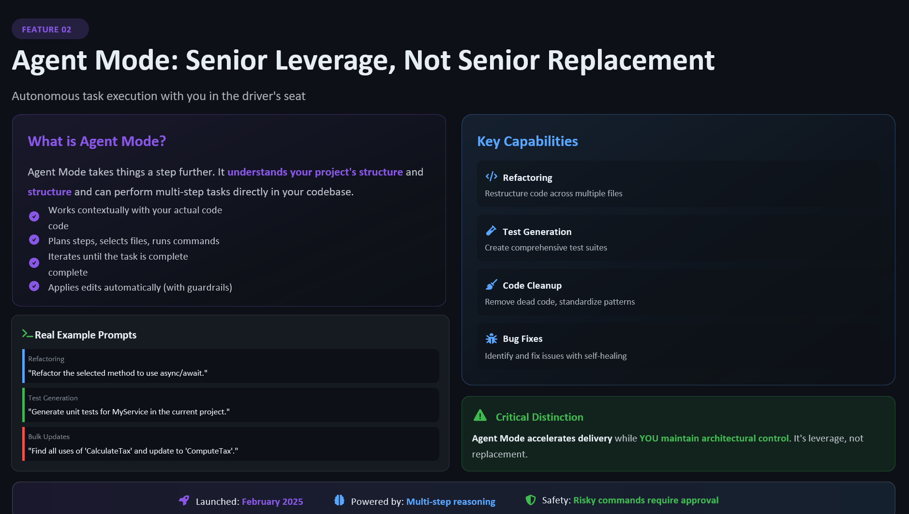

<div class="hero">
  
</div>

<span class="chapter-badge">Chapter 8</span>

# Agent Mode

Everything we've talked about so far has been collaborative — you and Copilot, working together on individual functions, tests, and reviews. You're always present. You're always in the loop.

Agent Mode is different.

In Agent Mode, Copilot can take multi-step tasks, make changes across multiple files, run commands, read error output, and iterate — all with less moment-to-moment input from you. It's closer to delegating than collaborating.

That's powerful. It's also the place where Rule Zero becomes most important.

---

## What Agent Mode Can Do

Agent Mode can handle:

- Scaffolding new features from a description
- Refactoring across multiple files with a consistent goal
- Writing test suites for existing code
- Fixing build errors and iterating until tests pass
- Setting up configuration files from specifications

For the right tasks, it's genuinely remarkable. A task that would take you two hours of focused work can be drafted in minutes.

---

## What Agent Mode Cannot Do

Agent Mode cannot:

- Know your architectural constraints unless you tell it
- Understand your team's unwritten conventions
- Weigh your tradeoffs against your business context
- Catch security issues that require domain knowledge
- Be held accountable for production incidents

These are all *your* jobs. Agent Mode doesn't reduce them. It just moves the sequence — you do more of your work at the beginning (as instructions) and the end (as review) rather than in the middle (as typing).

---

## The Delegation Mindset

When you delegate to a human colleague, you don't just say "build the auth system." You say:

- Here's what it needs to do
- Here are the constraints it must respect
- Here's what success looks like
- Here are the things you should check in with me about before deciding

Agent Mode works best with the same level of specification.

!!! tip "A template for Agent Mode prompts"
    ```
    Goal: [What should be built or changed?]
    Context: [What codebase, framework, existing patterns?]
    Constraints: [What must NOT change? What patterns must be followed?]
    Success criteria: [How will we know it worked?]
    Check-in points: [What decisions should it flag before making?]
    ```

The more specific your delegation, the more useful the output.

---

## Reviewing Agent Mode Output

Because Agent Mode touches multiple files, your review process needs to match.

**Don't review the final state only.** Review the *changes* — the diff. Each file changed is a file you need to understand.

**Look for drift.** Agent Mode sometimes solves the stated problem but drifts from your architectural patterns. The code works. The tests pass. But it doesn't fit. Catch this in review, not in production.

**Run it yourself.** Don't just read the output of Agent Mode's test runs. Run the tests yourself. Run the application. Click through the UI. See what it actually does.

---

## The Oversight Gradient

Think of your oversight as a dial from 0 (no oversight) to 10 (you read every character).

For Agent Mode output on a critical path, set the dial to 8. Read everything. Test manually. Check for drift.

For a utility module with comprehensive tests and no production risk, maybe 5. Review the diff, run the tests, trust the pattern.

Adjust based on context. But the dial never goes to 0. **You own the code.**

---

## When Not to Use Agent Mode

Agent Mode is wrong for:

- Tasks where the requirements are unclear (clarify first)
- Security-sensitive changes (be hands-on here)
- Anything touching production data or infrastructure (always manual)
- Situations where you're already behind and don't have time to review properly (don't generate debt you can't afford)

Save Agent Mode for tasks where you're confident in your requirements, prepared for your review, and ready to own the result.

---

[← Chapter 7: A Mentor Loop](07-mentor-loop.md){ .md-button } &nbsp; [Next: Chapter 9 — Refactor Without Losing Architecture →](09-refactor.md){ .md-button }
