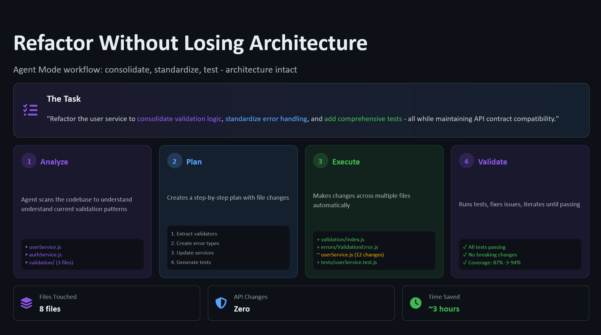

<div class="hero">
  
</div>

<span class="chapter-badge">Chapter 9</span>

# Refactor Without Losing Architecture

Refactoring is one of the places where Copilot can create the most value — and cause the most subtle damage.

The value: it can handle the mechanical parts of refactoring — renaming, restructuring, extracting, consolidating — at a speed that would take you hours to match.

The damage: it doesn't know your architecture. It knows your code. Those are different things.

---

## Architecture vs. Code

Architecture is the set of decisions you made about *how* things relate to each other, not just *what* they do.

- This module is stateless by design — all state lives in the service layer
- These components communicate through events, not direct calls
- This data transformation happens at the edge, before it touches the domain
- These dependencies point inward, never outward

Copilot can read those patterns from context — if the context is there. If the code already embodies them consistently, Copilot will usually continue them. But when you're refactoring a messy module, the patterns may not be clear. And Copilot will fill the gaps with the most locally plausible structure.

Which may not be your architecture.

---

## Encoding Architecture as Instructions

The most effective approach is to make your architecture explicit in your prompt — not as vague principles, but as concrete constraints.

```
// Refactor this authentication module.
// Constraints:
// - All state must remain in AuthService, not in AuthController
// - Database access only through the repository layer (AuthRepository)
// - No direct imports from infrastructure layer in domain layer
// - Error types must use our existing AuthError hierarchy
// - No new external dependencies
```

When you encode these constraints, you're giving Copilot a contract. If it violates the contract in its output, you catch it in review. Without the constraints, violations are invisible until they cause problems.

---

## The Pre-Refactor Documentation Step

Before any significant refactor with Copilot, do this:

!!! tip "Pre-refactor checklist"
    1. Write down the key architectural invariants this module must maintain
    2. List the boundaries it must respect (what it can and cannot depend on)
    3. Define what "done" looks like architecturally — not just functionally
    4. Note any patterns in the existing code that must be preserved

Then share this with Copilot as part of your prompt. You're not just asking it to refactor. You're asking it to refactor *within these boundaries*.

---

## Reviewing for Architecture, Not Just Correctness

When you review a Copilot-assisted refactor, review in two passes:

**Pass 1: Does it work?**
- Tests pass
- Behaviour is preserved
- No regressions

**Pass 2: Does it fit?**
- Module boundaries are respected
- Dependency direction is maintained
- Naming is consistent with your conventions
- State management follows your patterns
- Error handling matches your hierarchy

Pass 2 is where architectural drift hides. It rarely shows up in tests. It shows up six months later when someone adds a feature and follows the new, wrong pattern they found in the code.

---

## Small Commits, Clear Intent

Refactor with Copilot in small, focused commits. Each commit should have a clear purpose:

- "Extract payment calculation into PaymentCalculator"
- "Move validation logic from controller to request object"
- "Replace inline error handling with ErrorHandler middleware"

Small commits make architectural review tractable. They make rollback clean. And they create a record of the refactoring decisions that future engineers can follow.

---

## The Diff is the Document

Think of the diff of a refactor PR as a document describing an architectural decision. The best refactor PRs tell a story:

- This is what the code looked like
- This is what was wrong with it architecturally
- This is the direction we moved it
- This is the pattern you should follow in adjacent code

Copilot can help you write that code. You have to write that story.

---

[← Chapter 8: Agent Mode](08-agent-mode.md){ .md-button } &nbsp; [Next: Chapter 10 — Review the Diff →](10-review-diff.md){ .md-button }
