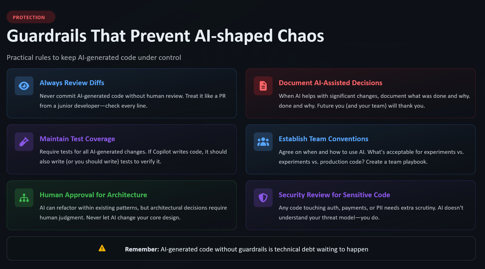

  

Chapter 11

# Guardrails That Prevent AI-Shaped Chaos

Every team that adopts AI-assisted development eventually learns the same lesson: speed without structure doesn't just create bugs — it creates *patterns* of bugs. Systematic, reproducible, hard-to-track-down failures that look different every time but share a common root.

The root is usually: no guardrails.

---

## What Guardrails Are

Guardrails are the systems, practices, and agreements that keep AI assistance within the bounds of what your team can safely handle.

They're not restrictions on Copilot. They're agreements about how your team works with it — what it's used for, how output is reviewed, what can and can't be automated, and how you catch the failures that still slip through.

Guardrails are what separate "AI assistance" from "AI chaos."

---

## Code Guardrails

Start with the technical layer:

!!! tip "Technical guardrails to consider"
    - **Linting and formatting rules** — enforced in CI, not just recommended in PRs
    - **Type checking** — strict mode TypeScript (or equivalent) makes Copilot suggestions more predictable and verifiable
    - **Test coverage thresholds** — don't let generated code bypass coverage requirements
    - **Dependency audit** — CI checks for known vulnerabilities in suggested packages
    - **Secret scanning** — catch any credentials that sneak into generated code
    - **SAST tooling** — static analysis to catch common security patterns Copilot might introduce

These run in CI. They're automatic. They catch things that human review misses — not because humans are bad reviewers, but because humans get tired and CI doesn't.

---

## Process Guardrails

Beyond the technical layer, you need process:

**PR size limits.** Copilot makes it easy to generate large diffs. Large diffs are hard to review. Set a soft limit on PR size and break large AI-assisted changes into reviewable units.

**Review requirements for AI-heavy PRs.** Some teams flag PRs where AI assistance was significant (via a label or a comment) and require an additional review pass. This isn't distrust — it's appropriate rigour for a different kind of PR.

**Merge queue discipline.** Don't let generated code skip the queue. If anything, AI-assisted PRs should have stricter merge requirements, not more permissive ones.

**Architecture decision records (ADRs).** When Copilot proposes a structural change that's accepted, document why. Future engineers need to know if that pattern was chosen deliberately or inherited from an autocomplete.

---

## Cultural Guardrails

The hardest guardrails to implement. The most important.

**Normalise pushback.** Create a culture where "I'm not sure I understand this Copilot output — let's slow down" is valued, not penalised.

**Celebrate thorough reviews.** Not just bug-finds — the review that caught an architectural drift, the comment that asked a clarifying question, the PR that was sent back with "this works but doesn't fit our patterns."

**Share failures, not just wins.** When AI-generated code causes an incident, learn from it publicly. What guardrail was missing? What would catch it next time?

---

## The Guardrail Audit

Once a quarter, ask your team:

1. What AI-related failures have we had in the last 90 days?
2. What guardrail was missing that would have caught them?
3. What guardrail exists but isn't being used effectively?
4. What new pattern are we seeing that we don't have a guardrail for?

This is a living system. Copilot's capabilities are evolving. Your guardrails should evolve with them.

---

## Guardrails Enable Speed

Here's the counterintuitive truth: guardrails make you faster.

Not by removing friction — they add friction. But they add it in the *right places*. They make the fast path the safe path. They let you move quickly in the 95% of cases that are fine, because you know the 5% that aren't will be caught.

Without guardrails, every fast move carries anxiety. Every PR ships with a side of "I hope this is okay." That anxiety is expensive. It's also unnecessary.

Build the guardrails. Move fast inside them.

---

[← Chapter 10: Review the Diff](10-review-diff.md){ .md-button } &nbsp; [Next: Chapter 12 — Security →](12-security.md){ .md-button }
