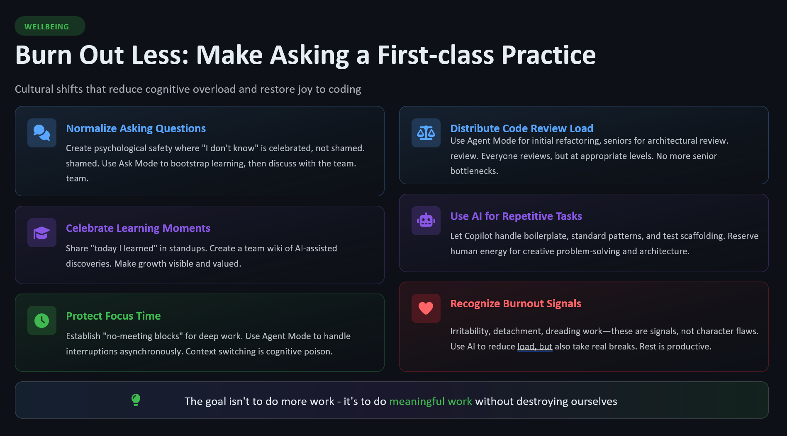

  

Chapter 14

# Burn Out Less: Make Asking a First-Class Practice

If you've made it this far, you already know the argument: AI assistance done well can accelerate you without hollowing you out. The habits, the ownership, the asking, the reviewing — these protect you.

But let's be direct about the thing this whole book has been building toward.

Burnout is real. It's common in engineering. And the adoption of AI tools has, for many developers, made it worse — not because AI assistance causes burnout, but because it accelerates the patterns that do.

---

## What Burnout Actually Looks Like in Engineering

Burnout isn't always a collapse. Often it's a slow drift:

- You stop being curious about code. You just want it to work.
- You stop pushing back. It's easier to accept and ship.
- You review PRs faster. Not because you've gotten better at it. Because you're tired.
- You feel productive — metrics look fine — but hollow. Like you're doing the motions.
- You think about work at 2am, not because you love it, but because you're anxious about what slipped through.

This is not weakness. It's physiology. It's what happens to humans who carry sustained cognitive load without recovery.

---

## How AI Assistance Can Accelerate Burnout

The acceleration loop looks like this:

1. Copilot makes you faster
2. Faster output creates expectation of more output
3. More output means more review burden, more cognitive load
4. The review load is invisible — it doesn't show up in velocity metrics
5. You're producing more but understanding less
6. The anxiety fills the gap between production and understanding
7. You push through the anxiety with more speed
8. You're exhausted, anxious, and shipping code you don't fully own

This is the pattern. The question is how to break it.

---

## Making Asking a First-Class Practice

The title of this chapter — and this book — is a practice, not just a mindset.

Making asking first-class means:

**In your own work:**
- Budget time to ask questions — to Copilot, to colleagues, to documentation — not just to code
- Treat asking as work, not as a detour from work
- Protect the time you use to understand things properly

**In your team:**
- Celebrate thorough questions as much as fast solutions
- Create space for "I'm not sure about this" in PR reviews
- Make it safe to ask Copilot things you "should" already know

**In your culture:**
- Remove the status overhead of asking
- Make slowness for the sake of understanding visible and valued
- Treat curiosity as a professional asset, not a liability

---

## The Recovery Practices That Help

Beyond the Copilot-specific habits, these help:

!!! tip "Sustainable engineering practices"
    - **Bounded work hours** — acceleration without limits is unsustainable by definition
    - **Explicit transitions** — close the laptop, end the workday with a clear boundary
    - **Code that you love** — keep at least some time each week for code you find genuinely interesting
    - **Non-code time** — your brain processes problems in background while you rest. This is not wasted time.
    - **Regular retrospectives** — with yourself, about how the work feels, not just how it performs

---

## The Hardest Thing to Protect

The hardest thing to protect when you're moving fast is the thing that makes you good at this job: your judgment.

Judgment is expensive. It requires mental energy, context, and the willingness to be slow when slow is right. AI assistance doesn't replace judgment — it makes it more important, because the volume and speed of decisions has increased.

When you're burned out, judgment is the first thing to go. Your code still runs. Your tests still pass. But the decisions you're making — about architecture, about tradeoffs, about what's good enough and what isn't — are being made by a version of you that isn't at their best.

Burnout doesn't just hurt you. It hurts the code.

---

## The Practice

Start here, right now:

1. **Name one thing you shipped recently that you don't fully understand.**
   Go look at it. Ask Copilot to explain it. Understand it.

2. **Name one habit from this book you'll start this week.**
   One. Not five. Not a full system overhaul. One thing.

3. **Name one thing you'll protect about your capacity.**
   A boundary, a practice, a kind of work you love. Protect it.

The rest follows from those three things.

---

[← Chapter 13: The Playbook](13-playbook.md){ .md-button } &nbsp; [Next: Chapter 15 — The Call to Action →](15-call-to-action.md){ .md-button }
