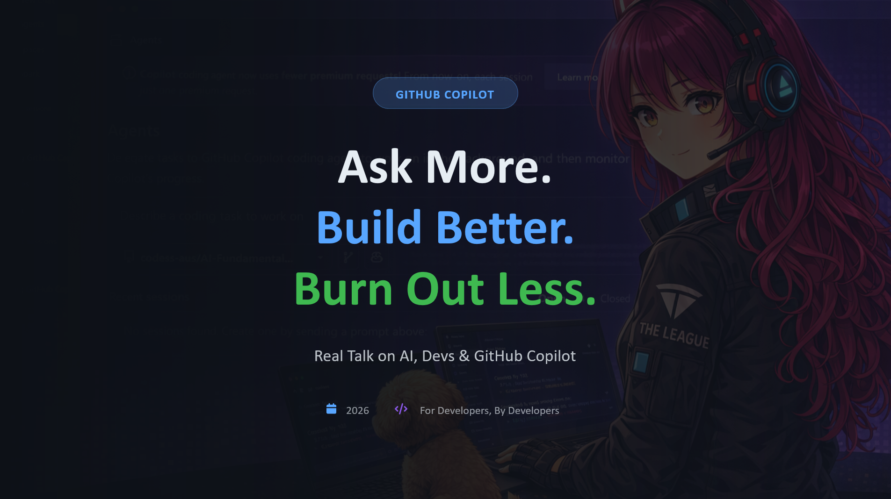

  

# Welcome

This book is for developers who are curious, a little tired, and ready to work smarter.

It's not a manual for GitHub Copilot. It's a field guide for the humans who use it — the ones writing the prompts, reviewing the diffs, and still lying awake wondering if they shipped something broken.

GitHub Copilot is a remarkable tool. But tools don't stop burnout. Habits do. Mindset does. Knowing when to ask, how to ask, and what to do with the answer — that's what this book is about.

---

## What You'll Find Here

!!! tip "Chapters at a glance"
    Each chapter tackles a real pattern — from how to frame questions to how to guard your architecture, from security to sustainability.

| Chapter | Topic |
|---------|-------|
| 1 | [Reality Check](chapters/01-reality-check.md) — The state of AI-assisted development |
| 2 | [The Paradox](chapters/02-the-paradox.md) — When faster feels slower |
| 3 | [Rule Zero](chapters/03-rule-zero.md) — You own the code |
| 4 | [Ask Mode](chapters/04-ask-mode.md) — Prompting as a first-class skill |
| 5 | [Turn a Failing Test](chapters/05-failing-test.md) — Into a learning plan |
| 6 | [The Million Questions Workflow](chapters/06-million-questions.md) — Iterate without shame |
| 7 | [A Mentor Loop](chapters/07-mentor-loop.md) — Teaching and being taught |
| 8 | [Agent Mode](chapters/08-agent-mode.md) — Handing off the wheel |
| 9 | [Refactor Without Losing Architecture](chapters/09-refactor.md) — Change with confidence |
| 10 | [Review the Diff](chapters/10-review-diff.md) — Owning what Copilot writes |
| 11 | [Guardrails](chapters/11-guardrails.md) — Preventing AI-shaped chaos |
| 12 | [Security](chapters/12-security.md) — The bug you ship when you're exhausted |
| 13 | [The Playbook](chapters/13-playbook.md) — Patterns that work |
| 14 | [Burn Out Less](chapters/14-burn-out-less.md) — Making asking a first-class practice |
| 15 | [The Call to Action](chapters/15-call-to-action.md) — What comes next |

---

## Who This Is For

- Developers who've added Copilot to their workflow but aren't sure they're using it well
- Teams who want to move fast *and* maintain quality
- Anyone who's ever accepted a suggestion they didn't fully understand — and shipped it anyway
- Engineers who care about their craft and their longevity

---

## How to Read This

You can read it front to back. Or jump to the chapter that matches where you are right now. Each chapter stands alone. Each one gives you something actionable.

But if you're feeling the edges of burnout — start with Chapter 14. Come back to the rest when you're ready.

[Start Reading → Chapter 1: Reality Check](chapters/01-reality-check.md){ .md-button }
